# seichi-onp-k8s / cluster-boot-up

オンプレミス上に整地鯖用のKubernetesクラスタをデプロイするためのスクリプト及び設定群です。
構築の前提としているオンプレ環境については、[オンプレ環境の前提](#オンプレ環境の前提)を参照してください。

## ディレクトリ構成について

 - [`docs/diagrams`](./docs/diagrams/)
   
    当ディレクトリの設定に関する図等を管理しています。

 - [`scripts`](./scripts)

    クラスタセットアップ等の操作時に、端末で、もしくは自動的に実行されるスクリプト群を管理しています。各スクリプトは、基本的に `./scripts/<スクリプトを実行する環境名>/<スクリプト名>.sh` の規則で命名されています。

 - [`snippets`](./snippets)

    クラスタ内のVMに対してVIP割り当て等を指定する snippet を管理しています。

## オンプレ環境の前提

### VM 環境

VM環境は `Proxmox Virtual Environment 7.1-11` を利用しています。

 - ベアメタル3ノード

 - クラスタ構成済みであること

   - クラスタ構成にすると、proxmoxホスト間でrootユーザーによるSSH接続が可能となります。

     これはクラスタの各種機能を維持するために使用されています。また、手順やスクリプトの一部はこのSSH接続を前提としています。
     
     参考: [Role of SSH in Proxmox VE Clusters - proxmox wiki](https://pve.proxmox.com/wiki/Cluster_Manager#_role_of_ssh_in_proxmox_ve_clusters)

 - AMDとIntelが混在しているので、アーキテクチャを跨いだLive Migrationは不可

KubernetesノードのVMは cloudinit イメージで作成されています。
この cloudinit イメージのベースには `Ubuntu 22.04 LTS` を利用しています。

### ストレージ

以下のストレージを共有ストレージとして使用しています。
 - Synology NAS(DS1621+)

### ネットワーク

以下のネットワークセグメントを切っています。
 - Service Network (192.168.0.0/20)
 - Storage Network (192.168.16.0/22)
 - Kubernetes
   - Internal
     - Pod Network (10.128.0.0/16)
     - Service Network (10.96.0.0/16)
   - External
     - Node IP
       - Service Network (192.168.8.0-192.168.8.127)
       - Storage Network (192.168.18.0-192.168.18.127)
     - API Endpoint (192.168.18.100)
     - LoadBalancer VIP (192.168.8.128-192.168.8.255)

## Kubernetesクラスタの構成

2022/05/23現在、クラスタは (3 control plane nodes + 3 worker nodes) の構成で[作成されています](https://github.com/GiganticMinecraft/seichi_infra/blob/9b6a9346371b8f2add3a786b6badbe4e13d4464c/seichi-onp-k8s/cluster-boot-scripts/deploy-vm.sh#L14-L19)。

クラスタの作成は以下のツール群で行っています。
  - kubeadm, kubectl, kubelet v1.27.1

CNI には Cilium を利用しています。


## 作成フロー

### 概要

以下に列挙した、[オンプレ環境の前提](#オンプレ環境の前提)を満たすために必要な作業の詳細は、当ディレクトリでは管理しないこととします。
 - ベアメタルなProxmox環境の構築
 - Snippetが配置可能な共有ストレージの構築
 - VM Diskが配置可能な共有ストレージの構築
 - Network周りの構築

後述する手順で `scripts/proxmox-host-terminal/deploy-vm.sh` を実行すると、k8sクラスタの構築に利用するVMテンプレートが作成されたのち、k8sクラスタのノードとなるVMが沸きます。

その後、`cp-1` を最初のマスターノードとして、作成した全ノードをクラスタ内に引き込みます。

### 手順

 1. **proxmoxをホストしている物理マシンのターミナル上で**、VMを定義/作成するための以下の手順を実行します。
 
     1. 必要なパラメータを設定します。

        ```bash
        TARGET_BRANCH=main
        ```

        `TARGET_BRANCH` は、デプロイ対象のスクリプト(`scripts/`)及び設定ファイル(`snippets/`)への変更が反映されたブランチを指定してください。

     1. `scripts/proxmox-host-terminal/deploy-vm.sh` を実行します。

        ```sh
        /bin/bash <(curl -s https://raw.githubusercontent.com/GiganticMinecraft/seichi_infra/${TARGET_BRANCH}/seichi-onp-k8s/cluster-boot-up/scripts/proxmox-host-terminal/deploy-vm.sh) ${TARGET_BRANCH}
        ```

 1. **ローカルマシンのターミナルから**で、作業を続行するための準備をします。以下、すべての作業はローカルマシンのターミナルより行われます。

    ```bash
    TARGET_BRANCH=main
    ```

    `TARGET_BRANCH` は、デプロイ対象のスクリプト(`scripts/`)及び設定ファイル(`snippets/`)への変更が反映されたブランチを指定してください。

 1. 生成した全ノードにローカルマシンから接続できるようにします。

     1. 次のスクリプトを実行し、必要なパラメータをセットします。

        `TARGET_BRANCH` は、デプロイ対象のスクリプト(`scripts/`)及び設定ファイル(`snippets/`)への変更が反映されたブランチを指定してください。

        ```bash
        TARGET_BRANCH=main
        IDENTITY_FILE_PATH=<接続に利用する秘密鍵へのパス>
        BASTION_HOST_NAME=<踏み台サーバーのホスト名>
        ```

     1. 次のスクリプトを実行し、踏み台サーバーを介した接続に必要な設定を生成します。

        ```bash
        ssh_additional_config=$(cat <<EOF
        Host seichi-onp-k8s-cp-1
          HostName 192.168.18.11
          User cloudinit
          IdentityFile ${IDENTITY_FILE_PATH}
          ProxyCommand ssh -W %h:%p ${BASTION_HOST_NAME}

        Host seichi-onp-k8s-cp-2
          HostName 192.168.18.12
          User cloudinit
          IdentityFile ${IDENTITY_FILE_PATH}
          ProxyCommand ssh -W %h:%p ${BASTION_HOST_NAME}

        Host seichi-onp-k8s-cp-3
          HostName 192.168.18.13
          User cloudinit
          IdentityFile ${IDENTITY_FILE_PATH}
          ProxyCommand ssh -W %h:%p ${BASTION_HOST_NAME}

        Host seichi-onp-k8s-wk-1
          HostName 192.168.18.21
          User cloudinit
          IdentityFile ${IDENTITY_FILE_PATH}
          ProxyCommand ssh -W %h:%p ${BASTION_HOST_NAME}

        Host seichi-onp-k8s-wk-2
          HostName 192.168.18.22
          User cloudinit
          IdentityFile ${IDENTITY_FILE_PATH}
          ProxyCommand ssh -W %h:%p ${BASTION_HOST_NAME}

        Host seichi-onp-k8s-wk-3
          HostName 192.168.18.23
          User cloudinit
          IdentityFile ${IDENTITY_FILE_PATH}
          ProxyCommand ssh -W %h:%p ${BASTION_HOST_NAME}
        EOF
        )
        ```

     1. 次のスクリプトを実行して、`~/.ssh/config` に設定を追記してください。

        ```bash
        echo "${ssh_additional_config}" >> ~/.ssh/config
        ```

        もし生成された設定を確認したい場合は、 `echo "${ssh_additional_config}"` のみを実行してください。

     1. 以下のコマンドをローカル端末で実行してください。

        ```bash
        # known_hosts登録削除(VM作り直す度にホスト公開鍵が変わるため)
        ssh-keygen -R 192.168.18.11
        ssh-keygen -R 192.168.18.12
        ssh-keygen -R 192.168.18.13
        ssh-keygen -R 192.168.18.21
        ssh-keygen -R 192.168.18.22
        ssh-keygen -R 192.168.18.23

        # 接続チェック(ホスト公開鍵の登録も兼ねる)
        ssh seichi-onp-k8s-cp-1 "hostname"
        ssh seichi-onp-k8s-cp-2 "hostname"
        ssh seichi-onp-k8s-cp-3 "hostname"
        ssh seichi-onp-k8s-wk-1 "hostname"
        ssh seichi-onp-k8s-wk-2 "hostname"
        ssh seichi-onp-k8s-wk-3 "hostname"
        ```

 1. クラスタの基点となる cp-1 の初期化が終わっていることをチェックします。

    ```bash
    # 最初のコントロールプレーンのkubeadm initが終わっているかチェック
    ssh seichi-onp-k8s-cp-1 "kubectl get node -o wide && kubectl get pod -A -o wide"
    ```

 1. 各VMの実行ログをチェックします。

    ```bash
    ssh seichi-onp-k8s-cp-1 "sudo cat /var/log/cloud-init-output.log"
    ssh seichi-onp-k8s-cp-2 "sudo cat /var/log/cloud-init-output.log"
    ssh seichi-onp-k8s-cp-3 "sudo cat /var/log/cloud-init-output.log"
    ssh seichi-onp-k8s-wk-1 "sudo cat /var/log/cloud-init-output.log"
    ssh seichi-onp-k8s-wk-2 "sudo cat /var/log/cloud-init-output.log"
    ssh seichi-onp-k8s-wk-3 "sudo cat /var/log/cloud-init-output.log"
    
    ## cloud-final.service - Execute cloud user/final scripts
    ## k8s-node-setup.sh などのログはここにあります
    ssh seichi-onp-k8s-cp-1 "sudo journalctl -u cloud-final.service"
    ssh seichi-onp-k8s-cp-2 "sudo journalctl -u cloud-final.service"
    ssh seichi-onp-k8s-cp-3 "sudo journalctl -u cloud-final.service"
    ssh seichi-onp-k8s-wk-1 "sudo journalctl -u cloud-final.service"
    ssh seichi-onp-k8s-wk-2 "sudo journalctl -u cloud-final.service"
    ssh seichi-onp-k8s-wk-3 "sudo journalctl -u cloud-final.service"
    ```

 1. k8s API endpoint へのインターネットからの経路を確立するために、 `cloudflared` の Deployment リソースと、その実行に必要な Cloudflare の API Token を Secret として注入します。

    以下のスクリプトを実行します。スクリプトの内容は、 [実行される当該スクリプト](./scripts/local-terminal/deploy-k8s-api-cloudflared-resources-to-cp-1.sh) を参照してください。

    ```bash
    /bin/bash <(curl -s "https://raw.githubusercontent.com/GiganticMinecraft/seichi_infra/${TARGET_BRANCH}/seichi-onp-k8s/cluster-boot-up/scripts/local-terminal/deploy-k8s-api-cloudflared-resources-to-cp-1.sh") "${TARGET_BRANCH}"
    ```

 1. 作成した全ノードをクラスタ内に引き込みます。

    以下のコマンドをローカル端末で実行してください。

    ```sh
    # join_kubeadm_cp.yaml を seichi-onp-k8s-cp-2 と seichi-onp-k8s-cp-3 にコピー
    scp -3 seichi-onp-k8s-cp-1:~/join_kubeadm_cp.yaml seichi-onp-k8s-cp-2:~/
    scp -3 seichi-onp-k8s-cp-1:~/join_kubeadm_cp.yaml seichi-onp-k8s-cp-3:~/

    # seichi-onp-k8s-cp-2 と seichi-onp-k8s-cp-3 で kubeadm join
    ssh seichi-onp-k8s-cp-2 "sudo kubeadm join --config ~/join_kubeadm_cp.yaml"
    ssh seichi-onp-k8s-cp-3 "sudo kubeadm join --config ~/join_kubeadm_cp.yaml"

    # join_kubeadm_wk.yaml を seichi-onp-k8s-wk-1 と seichi-onp-k8s-wk-2 と seichi-onp-k8s-wk-3 にコピー
    scp -3 seichi-onp-k8s-cp-1:~/join_kubeadm_wk.yaml seichi-onp-k8s-wk-1:~/
    scp -3 seichi-onp-k8s-cp-1:~/join_kubeadm_wk.yaml seichi-onp-k8s-wk-2:~/
    scp -3 seichi-onp-k8s-cp-1:~/join_kubeadm_wk.yaml seichi-onp-k8s-wk-3:~/

    # seichi-onp-k8s-wk-1 と seichi-onp-k8s-wk-2 と seichi-onp-k8s-wk-3 で kubeadm join
    ssh seichi-onp-k8s-wk-1 "sudo kubeadm join --config ~/join_kubeadm_wk.yaml"
    ssh seichi-onp-k8s-wk-2 "sudo kubeadm join --config ~/join_kubeadm_wk.yaml"
    ssh seichi-onp-k8s-wk-3 "sudo kubeadm join --config ~/join_kubeadm_wk.yaml"
    ```

 1. コントロールプレーンの全ノードにkubeconfigを配布します。

    以下のコマンドをローカル端末で実行してください。

    ```bash
    ssh seichi-onp-k8s-cp-2 "mkdir -p \$HOME/.kube && sudo cp -i /etc/kubernetes/admin.conf \$HOME/.kube/config &&sudo chown \$(id -u):\$(id -g) \$HOME/.kube/config"
    ssh seichi-onp-k8s-cp-3 "mkdir -p \$HOME/.kube && sudo cp -i /etc/kubernetes/admin.conf \$HOME/.kube/config &&sudo chown \$(id -u):\$(id -g) \$HOME/.kube/config"
    ```

 1. 軽い動作チェック

    以下のコマンドをローカル端末で実行してください。

    ```sh
    ssh seichi-onp-k8s-cp-1 "kubectl get node -o wide && kubectl get pod -A -o wide"
    ssh seichi-onp-k8s-cp-2 "kubectl get node -o wide && kubectl get pod -A -o wide"
    ssh seichi-onp-k8s-cp-3 "kubectl get node -o wide && kubectl get pod -A -o wide"
    ```

## クラスタ操作

### コントロールプレーンのノードを経由してクラスタを操作する

作成フローが完了した時点で、Proxmox上に `seichi-onp-k8s-cp-[1-3]` で識別される VM が作成されているはずです。以下、これらの VM の事を「CPノード」と呼びます。CPノードである VM は、k8s クラスタのコントロールプレーンノードとして機能しています。

3 つあるCPノードのうちの一つにSSHでログインし、 `kubectl` を利用することでクラスタを操作することができます。

---

__**アクセス権限について**__

CPノードにアクセスするのに必要な権限は、
 - 「オンプレネットワークの踏み台サーバー」へのSSH権限
 - CPノードの `cloudinit` ユーザーの `authorized_keys` に自身の公開鍵が登録されている ([CPノードのログインに利用できる公開鍵について](#CPノードのログインに利用できる公開鍵について)を参照)

の二つです。もし権限が不足している場合は、サーバー管理者に権限を要求してください。

---

以下、前提として、踏み台サーバーへの接続情報は `~/.ssh/config` にすでに記載されているものとします。
CPノードへSSHでログインするには、作業者のローカル端末で以下の手順を実行してください。

 1. `~/.ssh/config` にCPノードへの接続情報を追記する

    もしCPノードへの接続情報が `~/.ssh/config` にすでに記載されていない場合、以下の手順を実行してください。

    1. ターミナルで次のスクリプトを実行し、必要なパラメータをセットする。

        ```bash
        IDENTITY_FILE_PATH=<接続に利用する秘密鍵へのパス>
        BASTION_HOST_NAME=<踏み台サーバーのホスト名>
        ```

    1. 次のスクリプトを実行し、踏み台サーバーを介した接続に必要な設定を生成する。

        ```bash
        ssh_additional_config=$(cat <<EOF
        Host seichi-onp-k8s-cp-1
          HostName 192.168.18.11
          User cloudinit
          IdentityFile ${IDENTITY_FILE_PATH}
          ProxyCommand ssh -W %h:%p ${BASTION_HOST_NAME}

        Host seichi-onp-k8s-cp-2
          HostName 192.168.18.12
          User cloudinit
          IdentityFile ${IDENTITY_FILE_PATH}
          ProxyCommand ssh -W %h:%p ${BASTION_HOST_NAME}

        Host seichi-onp-k8s-cp-3
          HostName 192.168.18.13
          User cloudinit
          IdentityFile ${IDENTITY_FILE_PATH}
          ProxyCommand ssh -W %h:%p ${BASTION_HOST_NAME}
        EOF
        )
        ```

    1. 次のスクリプトを実行する。

        ```bash
        echo "${ssh_additional_config}" >> ~/.ssh/config
        ```

       もし生成された設定を確認したい場合は、 `echo "${ssh_additional_config}"` のみを実行してください。

 1. 前回接続した後にクラスタが再作成されている場合は、以下のコマンドで `known_hosts` の登録を削除してください。

    ```sh
    ssh-keygen -R 192.168.18.11
    ssh-keygen -R 192.168.18.12
    ssh-keygen -R 192.168.18.13
    ```

    `known_hosts` の登録を削除する必要がある理由は、VMを作り直す度にホストの公開鍵が変わるためです。

 1. 以下のコマンドを実行して接続チェック、及びクラスタへのアクセスができることの確認を行ってください。

    ```sh
    ssh seichi-onp-k8s-cp-1 "kubectl get node -o wide && kubectl get pod -A -o wide"
    ssh seichi-onp-k8s-cp-2 "kubectl get node -o wide && kubectl get pod -A -o wide"
    ssh seichi-onp-k8s-cp-3 "kubectl get node -o wide && kubectl get pod -A -o wide"
    ```

---

#### CPノードのログインに利用できる公開鍵について

CPノードへのログインに利用できる鍵ペアは、クラスタを作成するタイミングで固定されています。

<details>
<summary>詳細</summary>

より具体的には、[`scripts/proxmox-host-terminal/deploy-vm.sh`](./scripts/proxmox-host-terminal/deploy-vm.sh)で作成される cloud-config (特に、user-config) で、GitHubに登録してある、CPノードへのアクセス権を与えたいユーザーの公開鍵を `/home/cloudinit/.ssh/authorized_keys` に書き込むように[設定](https://github.com/GiganticMinecraft/seichi_infra/blob/10347c55fc09f08464fbc3d976a763262036557b/seichi-onp-k8s/cluster-boot-up/scripts/proxmox-host-terminal/deploy-vm.sh#L98-L100)しています。

</details>

クラスタの再作成を伴わずにログイン可能な公開鍵を追加したい場合は、**全CPノード**の `/home/cloudinit/.ssh/authorized_keys` に追記してください。合わせて、次回のクラスタ作成時に反映されるよう、[`scripts/proxmox-host-terminal/deploy-vm.sh`](./scripts/proxmox-host-terminal/deploy-vm.sh)で作成される user-config の `runcmd:` 内への追記も行ってください。

### インターネットを介してクラスタを操作する

オンプレ環境の内部ネットワーク内からクラスタを操作する場合、各環境(検証用クラスタと本番用クラスタ)のHAProxyに持たせた k8s API Endpoint の VIP に接続することができます。

一方、API Endpointにインターネットから直接接続するための経路は、DoS攻撃等の懸念から設けていません。しかしながら、Terraform Cloud からリソースを注入する等の目的で、インターネットからクラスタAPIへの到達経路が必要となることがあります。

そこで、次のようなセットアップを行っています。

 - まず、クラスタのセットアップスクリプトにより、`k8s-api.onp-k8s.admin.local-tunnels.seichi.click` がクラスタAPIのSSL証明書のSAN(Subject Alternative Name)に追記されており、かつ、このドメイン(`k8s-api.onp-k8s.admin.local-tunnels.seichi.click`) は `127.0.0.1` を向くように[設定されて](../../terraform/cloudflare_dns_records.tf)います。

 - 次に、k8s クラスタ内に、 k8s API Endpoint を `k8s-api.onp-k8s.admin.seichi.click` に張った TCP Argo Tunnel でアクセスできるようにするための `cloudflared` インスタンスを常駐させています。



よって、`k8s-api.onp-k8s.admin.seichi.click` 上のトンネルへのアクセス権限がある任意の個人及びサービスは、 `127.0.0.1` の適当なポートに `k8s-api.onp-k8s.admin.seichi.click` へのトンネルを生やすことで、ローカル環境の `kubectl` 等が直接 API に問い合わせることができるようになります。

`k8s-api.onp-k8s.admin.seichi.click` 上のトンネルのアクセス制御の詳細は [`cloudflare_network_admin_services`](../../terraform/cloudflare_network_admin_services.tf)を参照してください。

## クラスタの削除

### 概要

クラスタを再作成する場合は、事前に以下の手順でクラスタの削除を行って下さい。

### 手順

 1. **proxmoxをホストしている物理マシンのターミナル上で**次のコマンドを実行し、クラスタを構成するVMを停止します。

    ```sh
    # unchama-sv-prox02上に存在するクラスタを構成するVMを停止する
    ssh 192.168.16.151 qm stop 1001
    ssh 192.168.16.151 qm stop 1101
    # unchama-sv-prox04上に存在するクラスタを構成するVMを停止する
    ssh 192.168.16.153 qm stop 1002
    ssh 192.168.16.153 qm stop 1102
    # unchama-sv-prox05上に存在するクラスタを構成するVMを停止する
    ssh 192.168.16.154 qm stop 1003
    ssh 192.168.16.154 qm stop 1103
    ```

 1. **proxmoxをホストしている物理マシンのターミナル上で**次のコマンドを実行し、クラスタを構成するVMを削除します。

    ```sh
    # unchama-sv-prox02上に存在するクラスタを構成するVMを削除する
    ssh 192.168.16.151 qm destroy 9050 --destroy-unreferenced-disks true --purge true
    ssh 192.168.16.151 qm destroy 1001 --destroy-unreferenced-disks true --purge true
    ssh 192.168.16.151 qm destroy 1101 --destroy-unreferenced-disks true --purge true
    # unchama-sv-prox04上に存在するクラスタを構成するVMを削除する
    ssh 192.168.16.153 qm destroy 1102 --destroy-unreferenced-disks true --purge true
    ssh 192.168.16.153 qm destroy 1002 --destroy-unreferenced-disks true --purge true
    # unchama-sv-prox05上に存在するクラスタを構成するVMを削除する
    ssh 192.168.16.154 qm destroy 1003 --destroy-unreferenced-disks true --purge true
    ssh 192.168.16.154 qm destroy 1103 --destroy-unreferenced-disks true --purge true
    ```

### クラスタの削除後、クラスタの再作成に失敗する場合

クラスタの削除後、同じVMIDでVMを再作成できず、クラスタの作成に失敗することがあります。

これは、クラスタの削除時に複数ノードでコマンド`qm destroy`が実行された際に、Device Mapperで生成された仮想ディスクデバイスの一部が消えずに残留することがあるためです。

上記事象に遭遇した場合は、以下**いずれか**の方法で解決を試みてください。

 - 残った仮想ディスクデバイスを手動で削除する

    1. クラスタを構成するVMが一部でも存在する場合は、事前にクラスタの削除を実施してください。

    1. その後、**proxmoxをホストしている物理マシンのターミナル上で**次のコマンドを実行し、残ったデバイスを削除します。

       ```sh
       for host in 192.168.16.151 192.168.16.153 192.168.16.154 ; do
         ssh $host dmsetup remove prd--network--01--lun01--vg01-vm--1001--cloudinit
         ssh $host dmsetup remove prd--network--01--lun01--vg01-vm--1002--cloudinit
         ssh $host dmsetup remove prd--network--01--lun01--vg01-vm--1003--cloudinit

         ssh $host dmsetup remove prd--network--01--lun01--vg01-vm--1101--cloudinit
         ssh $host dmsetup remove prd--network--01--lun01--vg01-vm--1102--cloudinit
         ssh $host dmsetup remove prd--network--01--lun01--vg01-vm--1103--cloudinit

         ssh $host dmsetup remove prd--network--01--lun01--vg01-vm--1001--disk--0
         ssh $host dmsetup remove prd--network--01--lun01--vg01-vm--1002--disk--0
         ssh $host dmsetup remove prd--network--01--lun01--vg01-vm--1003--disk--0

         ssh $host dmsetup remove prd--network--01--lun01--vg01-vm--1101--disk--0
         ssh $host dmsetup remove prd--network--01--lun01--vg01-vm--1102--disk--0
         ssh $host dmsetup remove prd--network--01--lun01--vg01-vm--1103--disk--0
       done
       ```

   参考: [cannot migrate - device-mapper:create ioctl on cluster failed - proxmox forum](https://forum.proxmox.com/threads/cannot-migrate-device-mapper-create-ioctl-on-cluster-failed.12221/)

 - 全proxmoxホストを再起動する

   proxmoxホスト上の全てのVMの停止を伴うため、サービス提供中の本番環境では推奨されません。
