# seichi-kubernetes

seichi.click network 向けの Kubernetes のクラスタ定義を管理するディレクトリです。

Production環境のBungeeCordは毎月10日20日30日の毎朝4時30分に、本リポジトリのGithub Actionsによって再起動されています。

概要図は `*/diagrams` 以下で、 draw.io によってパース可能なsvgファイルとして管理されています。これらを編集する場合は [Draw.io VS Code Integration](https://github.com/hediet/vscode-drawio) の利用を推奨します。

## 全体俯瞰図

| フルネーム  | 役割                                                                           | 
| ----------- | ------------------------------------------------------------------------------ | 
|  BungeeCord | Minecraftプロトコル用プロキシ                                                  | 

## `Service` の VIP 割り当て

`loadbalancerIP` が取りうる範囲に関しては、 [オンプレ環境のネットワーク構成に関する説明](https://github.com/GiganticMinecraft/seichi_infra/tree/83e996ec845ea2cd73d9cea391cd02a03435dbd8/seichi-onp-k8s/cluster-boot-up#%E3%83%8D%E3%83%83%E3%83%88%E3%83%AF%E3%83%BC%E3%82%AF) を参照してください。

### 外部からトラフィックが直接流入する `Service`

エンドユーザーからの HTTP 通信を受け取るサービスは、パケットをすべて Cloudflare Tunnel (`cloudflared` による) で終端しているため、インターネットからそれらサービスへの ingress の経路は用意してません。

しかし、以下に記す例外では、 (TCP) パケットの送信元から対応するサービスへと
TCP パケットをそのまま送り届ける必要があります。

 - 投票サイトからの投票パケットは、投票受付 Minecraft サーバーへ
 - TCPShield からの Minecraft ゲームパケットは、 BungeeCord をまとめる `Service` へ

よって、これらサービスに限っては、

 - 対応する `Service` リソース達に `loadbalancerIP` を振り
 - オンプレのルーターからこれら VIP へのポートフォワードを (unchamaが) 設定し
 - パケット送信元のサービスに global IP とフォワードされている外向きのポートを登録しておく
 
という構成になっています。

この条件に該当する `Service` に割り当てられた `loadbalancerIP` は以下の通りです。

| サービス                     | `Service` の VIP                                            | 
| ---------------------------- | ----------------------------------------------------------- | 
|  BungeeCord (本番環境用)     | [`192.168.8.130`](https://github.com/GiganticMinecraft/seichi_infra/blob/83e996ec845ea2cd73d9cea391cd02a03435dbd8/seichi-onp-k8s/manifests/seichi-kubernetes/apps/seichi-gateway/bungeecord/service-bungeecord-loadbalancer.yaml#L8) | 
|  BungeeCord (デバッグ環境用) | [`192.168.8.131`](https://github.com/GiganticMinecraft/seichi_infra/blob/83e996ec845ea2cd73d9cea391cd02a03435dbd8/seichi-onp-k8s/manifests/seichi-kubernetes/apps/seichi-debug-gateway/bungeecord/service-bungeecord-loadbalancer.yaml#L8) | 
|  投票受付サーバー            | (まだ k8s 上に乗っていないので、 `Service` の VIP ではない) |

### オンプレネットワーク内からのトラフィックを受ける `Service`

レガシーな、オンプレネットワーク内のVMからトラフィックを受け取るサービスにも `loadbalancerIP` を割り当てています。

この条件に該当する `Service` に割り当てられた `loadbalancerIP` は以下の通りです。

| サービス                       | `Service` の VIP                                            | 
| ------------------------------ | ----------------------------------------------------------- | 
| 本番 RedisBungee 用 Redis      | [`192.168.8.132`](https://github.com/GiganticMinecraft/seichi_infra/blob/fc00e4f9b755798ed2fcd80c76b68dac49c3dc16/seichi-onp-k8s/manifests/seichi-kubernetes/apps/seichi-minecraft/redisbungee-redis.yaml#L24) |
| 本番 BungeeSemaphore 用 Redis  | [`192.168.8.133`](https://github.com/GiganticMinecraft/seichi_infra/blob/fc00e4f9b755798ed2fcd80c76b68dac49c3dc16/seichi-onp-k8s/manifests/seichi-kubernetes/apps/seichi-minecraft/bungeesemaphore-redis.yaml#L24) |
| Debug RedisBungee 用 Redis     | [`192.168.8.134`](https://github.com/GiganticMinecraft/seichi_infra/blob/fc00e4f9b755798ed2fcd80c76b68dac49c3dc16/seichi-onp-k8s/manifests/seichi-kubernetes/apps/seichi-debug-minecraft/redisbungee-redis.yaml#L24) |
| Debug BungeeSemaphore 用 Redis | [`192.168.8.135`](https://github.com/GiganticMinecraft/seichi_infra/blob/fc00e4f9b755798ed2fcd80c76b68dac49c3dc16/seichi-onp-k8s/manifests/seichi-kubernetes/apps/seichi-debug-minecraft/bungeesemaphore-redis.yaml#L24) |

## Kubernetes クラスタのブートストラップについて

Kubernetes 上で動いている(ArgoCD 以外の)すべての追加リソースはPull型の同期を行う ArgoCD によって管理されており、[`apps`](./apps/) ディレクトリ以下の特定のパスに対して行われた変更は ArgoCD によって自動的にクラスタに反映されます。

クラスタのブートストラップ、つまり ArgoCD 自体の管理は [Terraform](../../../terraform/) + [Helm Provider](https://registry.terraform.io/providers/hashicorp/helm/latest/docs) により行われています。そのため、クラスタを新規に作成した時は、Kubernetes にアクセスするための認証情報を Terraform Cloud のシークレットに登録し、Plan + Apply を行うことで ArgoCD とルートプロジェクトを初期化してください。

Terraform Cloud に登録すべき認証情報等のより詳細な情報は [`main.tf`](../../../terraform/main.tf) の variable 定義を参照してください。

## 注意事項(主にレビュアーや運営チームな方向け)
本リポジトリはPublicリポジトリを想定し、seichi.click networkに関する公開可能なインフラ構成についての情報を取り扱っています。コントリビュート/レビューにあたっては以下の点に留意してください。

  - 外部公開不可な情報(tokenやsecretなど)を復号可能な状態(平文やBASE64エンコしただけなど)でコードに含めないでください。
  - 外部コントリビュータからpullreqを受けた場合は、workflowが承認待ち状態(※1)となります。pullreqに含まれるコードがworkflow等を通じて意図的に秘匿情報にアクセスしようとしていないか、必ずコードレビューをした上でworkflowのrunを承認するようお願いします。

※1 Githubのリポジトリ設定で実現しています (`Settings -> Actions -> General -> Fork pull request workflows from outside collaborators -> Require approval for all outside collaborators`)。
