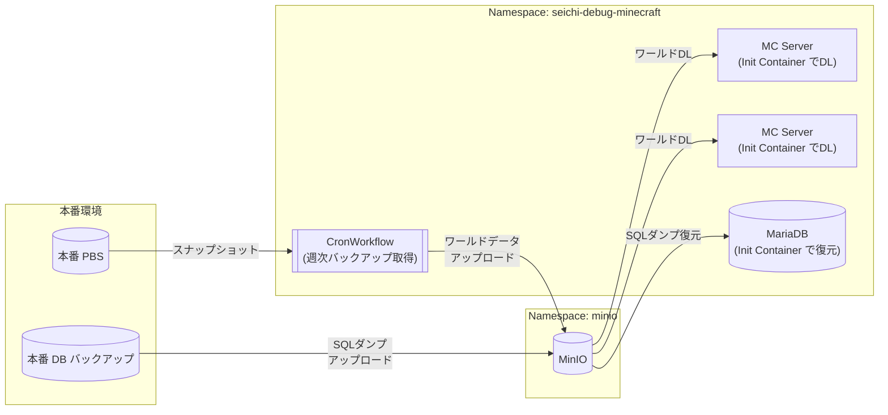
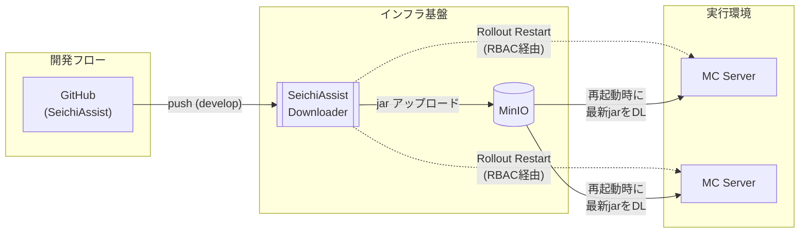
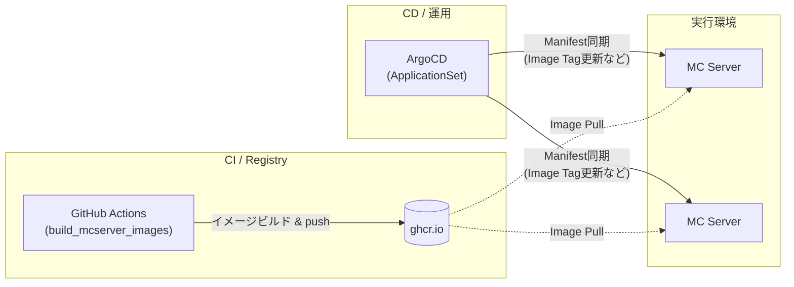

# seichi-debug-minecraft

## ワールドデータと DB のリストアフロー

```mermaid
graph LR
    subgraph prod["本番環境"]
        PBS[("本番 PBS")]
        DB_BACKUP[("本番 DB バックアップ")]
    end

    subgraph minio_ns["Namespace: minio"]
        MINIO[("MinIO")]
    end

    subgraph debug["Namespace: seichi-debug-minecraft"]
        CRON[["CronWorkflow<br/>(週次バックアップ取得)"]]

        S1["MC Server<br/>(Init Container でDL)"]
        S2["MC Server<br/>(Init Container でDL)"]
        MDB[("MariaDB<br/>(Init Container で復元)")]
    end

    PBS -->|"スナップショット"| CRON
    CRON -->|"ワールドデータ<br/>アップロード"| MINIO
    DB_BACKUP -->|"SQLダンプ<br/>アップロード"| MINIO

    MINIO -->|"ワールドDL"| S1
    MINIO -->|"ワールドDL"| S2
    MINIO -->|"SQLダンプ復元"| MDB
```

## SeichiAssist の自動更新フロー

```mermaid
graph LR
    subgraph dev["開発フロー"]
        REPO["GitHub<br/>(SeichiAssist)"]
    end

    subgraph infra["インフラ基盤"]
        DL[["SeichiAssist<br/>Downloader"]]
        MINIO[("MinIO")]
    end

    subgraph runtime["実行環境"]
        S1["MC Server"]
        S2["MC Server"]
    end

    REPO -->|"push (develop)"| DL
    DL -->|"jar アップロード"| MINIO
    DL -.->|"Rollout Restart<br/>(RBAC経由)"| S1
    DL -.->|"Rollout Restart<br/>(RBAC経由)"| S2
    
    MINIO -->|"再起動時に<br/>最新jarをDL"| S1
    MINIO -->|"再起動時に<br/>最新jarをDL"| S2
```

## サーバー本体の更新フロー

```mermaid
graph LR
    subgraph ci["CI / Registry"]
        GHA["GitHub Actions<br/>(build_mcserver_images)"]
        GHCR[("ghcr.io")]
    end

    subgraph cd["CD / 運用"]
        ARGOCD["ArgoCD<br/>(ApplicationSet)"]
    end

    subgraph runtime["実行環境"]
        S1["MC Server"]
        S2["MC Server"]
    end

    GHA -->|"イメージビルド & push"| GHCR
    
    ARGOCD --"Manifest同期<br/>(Image Tag更新など)"--> S1 & S2
    GHCR -.->|"Image Pull"| S1 & S2
```
